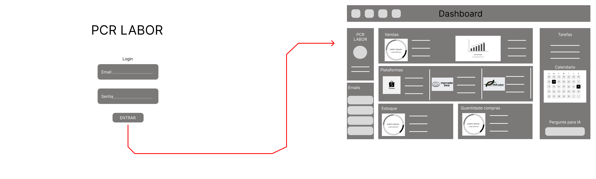

# Web Application Document - Projeto Individual - Módulo 2 - Inteli

## Pcr Labor

#### Cauã Pirilo Asquino

## Sumário

1. [Introdução](#c1)  
2. [Visão Geral da Aplicação Web](#c2)  
3. [Projeto Técnico da Aplicação Web](#c3)  
4. [Desenvolvimento da Aplicação Web](#c4)  
5. [Referências](#c5)  

<br>

## <a name="c1"></a>1. Introdução (Semana 01)

O projeto consiste no desenvolvimento de uma aplicação web para a empresa PCR Labor, com o objetivo de melhorar a integração entre plataformas de e-commerce (como Mercado Livre e Shopee). A aplicação vai consolidar informações de vendas, sugerir quantidades ideais de compra de produtos e fornecer relatórios de desempenho para facilitar o gerenciamento do estoque e a tomada de decisões comerciais.

---

## <a name="c2"></a>2. Visão Geral da Aplicação Web

### 2.1. Personas (Semana 01)

<div align="center">
  <sub></sub><br>
  <br>
  <sup>Fonte: Material produzido pelos autores, 2025</sup>
</div>

### 2.2. User Stories (Semana 01)

US01
Como gerente de operações, quero visualizar a quantidade de vendas por produto em tempo real, para que eu possa tomar decisões rápidas de reposição de estoque.

US02
Como gerente de operações, quero receber sugestões automáticas de compra baseadas no histórico de vendas, para que eu possa manter o estoque equilibrado.

US03
Como gerente de operações, quero consolidar as informações de vendas de múltiplas plataformas em um único painel, para que eu possa gerenciar os dados de forma mais eficiente.

Critério N – Negociável:
A US01 é negociável porque o gerente de operações pode escolher, por exemplo, se quer ver as vendas organizadas por categorias, por períodos específicos (últimos 7 dias, 30 dias) ou agrupadas por plataforma (Mercado Livre, Shopee). O formato e os filtros podem ser ajustados para melhor atender às necessidades do usuário sem alterar o objetivo principal da funcionalidade.

---

## <a name="c3"></a>3. Projeto da Aplicação Web

### 3.1. Modelagem do banco de dados  (Semana 3)

<div align="center">
  <sub></sub><br>
  <br>
  <sup>Fonte: Material produzido pelos autores, 2025</sup>
</div>


### Codigo SQL


```sql
-- Tabela de Empresas
CREATE TABLE IF NOT EXISTS Empresa (
    id_empresa SERIAL PRIMARY KEY,
    nome_fantasia VARCHAR(100) NOT NULL,
    cnpj VARCHAR(18) UNIQUE NOT NULL,
    created_at TIMESTAMP DEFAULT CURRENT_TIMESTAMP,
    updated_at TIMESTAMP DEFAULT CURRENT_TIMESTAMP
);

-- Tabela de Usuários (ligados à empresa)
CREATE TABLE IF NOT EXISTS Usuario (
    id_usuario SERIAL PRIMARY KEY,
    nome VARCHAR(100) NOT NULL,
    email VARCHAR(100) UNIQUE NOT NULL,
    senha_hash VARCHAR(255) NOT NULL,
    telefone VARCHAR(20),
    cargo VARCHAR(100),
    avatar VARCHAR(255),
    id_empresa INTEGER NOT NULL,
    created_at TIMESTAMP DEFAULT CURRENT_TIMESTAMP,
    updated_at TIMESTAMP DEFAULT CURRENT_TIMESTAMP,
    FOREIGN KEY (id_empresa) REFERENCES Empresa(id_empresa) ON DELETE CASCADE
);

-- Tabela de Plataformas (ex: Shopee, Mercado Livre)
CREATE TABLE IF NOT EXISTS Plataforma (
    id_plataforma SERIAL PRIMARY KEY,
    nome VARCHAR(50) NOT NULL UNIQUE,
    created_at TIMESTAMP DEFAULT CURRENT_TIMESTAMP
);

-- Tabela de Produtos (ligados à empresa)
CREATE TABLE IF NOT EXISTS Produto (
    id_produto SERIAL PRIMARY KEY,
    id_empresa INTEGER NOT NULL,
    nome VARCHAR(100) NOT NULL,
    sku VARCHAR(50) UNIQUE NOT NULL,
    preco DECIMAL(10,2) NOT NULL,
    preco_base DECIMAL(10,2) DEFAULT 0,
    custo_frete DECIMAL(10,2) DEFAULT 0,
    estoque_atual INTEGER NOT NULL DEFAULT 0,
    estoque_minimo INTEGER DEFAULT 10,
    categoria VARCHAR(50),
    descricao TEXT,
    ativo BOOLEAN DEFAULT true,
    created_at TIMESTAMP DEFAULT CURRENT_TIMESTAMP,
    updated_at TIMESTAMP DEFAULT CURRENT_TIMESTAMP,
    FOREIGN KEY (id_empresa) REFERENCES Empresa(id_empresa) ON DELETE CASCADE
);

-- Tabela de Vendas
CREATE TABLE IF NOT EXISTS Venda (
    id_venda SERIAL PRIMARY KEY,
    id_produto INTEGER NOT NULL,
    id_plataforma INTEGER NOT NULL,
    id_empresa INTEGER,
    quantidade INTEGER NOT NULL,
    data DATE NOT NULL,
    valor_total DECIMAL(10,2),
    numero_venda VARCHAR(50),
    preco_unitario DECIMAL(10,2),
    desconto DECIMAL(10,2) DEFAULT 0,
    taxa_plataforma DECIMAL(5,2) DEFAULT 0,
    valor_liquido DECIMAL(10,2),
    status VARCHAR(20) DEFAULT 'confirmada',
    id_usuario INTEGER,
    observacoes TEXT,
    created_at TIMESTAMP DEFAULT CURRENT_TIMESTAMP,
    FOREIGN KEY (id_produto) REFERENCES Produto(id_produto) ON DELETE CASCADE,
    FOREIGN KEY (id_plataforma) REFERENCES Plataforma(id_plataforma) ON DELETE CASCADE,
    FOREIGN KEY (id_empresa) REFERENCES Empresa(id_empresa) ON DELETE CASCADE,
    FOREIGN KEY (id_usuario) REFERENCES Usuario(id_usuario) ON DELETE SET NULL
);

-- Tabela de Pedidos
CREATE TABLE IF NOT EXISTS Pedido (
    id_pedido SERIAL PRIMARY KEY,
    id_produto INTEGER NOT NULL,
    id_plataforma INTEGER NOT NULL,
    id_empresa INTEGER,
    id_fornecedor INTEGER,
    quantidade INTEGER NOT NULL,
    status VARCHAR(20) DEFAULT 'PENDENTE',
    data_pedido DATE NOT NULL DEFAULT CURRENT_DATE,
    data_entrega DATE,
    valor_total DECIMAL(10,2),
    fornecedor VARCHAR(100),
    prioridade VARCHAR(20) DEFAULT 'media',
    observacoes TEXT,
    numero_pedido VARCHAR(50),
    aprovado_por INTEGER,
    data_aprovacao TIMESTAMP,
    created_at TIMESTAMP DEFAULT CURRENT_TIMESTAMP,
    updated_at TIMESTAMP DEFAULT CURRENT_TIMESTAMP,
    FOREIGN KEY (id_produto) REFERENCES Produto(id_produto) ON DELETE CASCADE,
    FOREIGN KEY (id_plataforma) REFERENCES Plataforma(id_plataforma) ON DELETE CASCADE,
    FOREIGN KEY (id_empresa) REFERENCES Empresa(id_empresa) ON DELETE CASCADE,
    FOREIGN KEY (id_fornecedor) REFERENCES Fornecedor(id_fornecedor) ON DELETE SET NULL,
    FOREIGN KEY (aprovado_por) REFERENCES Usuario(id_usuario) ON DELETE SET NULL
);

-- ===== TABELAS ADICIONAIS =====

-- Tabela de Fornecedores
CREATE TABLE IF NOT EXISTS Fornecedor (
    id_fornecedor SERIAL PRIMARY KEY,
    id_empresa INTEGER NOT NULL,
    nome VARCHAR(200) NOT NULL,
    cnpj VARCHAR(18),
    email VARCHAR(100),
    telefone VARCHAR(20),
    endereco TEXT,
    observacoes TEXT,
    ativo BOOLEAN DEFAULT true,
    created_at TIMESTAMP DEFAULT CURRENT_TIMESTAMP,
    updated_at TIMESTAMP DEFAULT CURRENT_TIMESTAMP,
    FOREIGN KEY (id_empresa) REFERENCES Empresa(id_empresa) ON DELETE CASCADE
);

-- Tabela de Tarefas (Sistema Kanban)
CREATE TABLE IF NOT EXISTS Tarefa (
    id_tarefa SERIAL PRIMARY KEY,
    id_usuario INTEGER NOT NULL,
    titulo VARCHAR(200) NOT NULL,
    descricao TEXT,
    status VARCHAR(20) DEFAULT 'a_fazer',
    prioridade VARCHAR(20) DEFAULT 'media',
    data_criacao TIMESTAMP DEFAULT CURRENT_TIMESTAMP,
    data_conclusao TIMESTAMP,
    created_at TIMESTAMP DEFAULT CURRENT_TIMESTAMP,
    updated_at TIMESTAMP DEFAULT CURRENT_TIMESTAMP,
    FOREIGN KEY (id_usuario) REFERENCES Usuario(id_usuario) ON DELETE CASCADE
);

-- Tabela de Sugestões de Compra
CREATE TABLE IF NOT EXISTS SugestaoCompra (
    id_sugestao SERIAL PRIMARY KEY,
    id_produto INTEGER NOT NULL,
    quantidade_sugerida INTEGER NOT NULL,
    motivo TEXT,
    prioridade VARCHAR(20) DEFAULT 'media',
    status VARCHAR(20) DEFAULT 'pendente',
    data_sugestao TIMESTAMP DEFAULT CURRENT_TIMESTAMP,
    processado_em TIMESTAMP,
    FOREIGN KEY (id_produto) REFERENCES Produto(id_produto) ON DELETE CASCADE
);

-- Tabela de Emails
CREATE TABLE IF NOT EXISTS Email (
    id_email SERIAL PRIMARY KEY,
    id_empresa INTEGER NOT NULL,
    id_remetente INTEGER,
    id_destinatario INTEGER,
    email_destinatario VARCHAR(100),
    assunto VARCHAR(200) NOT NULL,
    corpo TEXT NOT NULL,
    prioridade VARCHAR(20) DEFAULT 'normal',
    categoria VARCHAR(50) DEFAULT 'geral',
    status VARCHAR(20) DEFAULT 'enviado',
    lido BOOLEAN DEFAULT false,
    data_leitura TIMESTAMP,
    anexos TEXT,
    created_at TIMESTAMP DEFAULT CURRENT_TIMESTAMP,
    updated_at TIMESTAMP DEFAULT CURRENT_TIMESTAMP,
    FOREIGN KEY (id_empresa) REFERENCES Empresa(id_empresa) ON DELETE CASCADE,
    FOREIGN KEY (id_remetente) REFERENCES Usuario(id_usuario) ON DELETE SET NULL,
    FOREIGN KEY (id_destinatario) REFERENCES Usuario(id_usuario) ON DELETE SET NULL
);

-- Tabela de Movimentação de Estoque
CREATE TABLE IF NOT EXISTS MovimentacaoEstoque (
    id_movimentacao SERIAL PRIMARY KEY,
    id_produto INTEGER NOT NULL,
    id_empresa INTEGER NOT NULL,
    tipo_movimentacao VARCHAR(20) NOT NULL, -- 'entrada', 'saida', 'transferencia', 'full'
    quantidade INTEGER NOT NULL,
    quantidade_anterior INTEGER NOT NULL,
    quantidade_atual INTEGER NOT NULL,
    motivo VARCHAR(100),
    observacoes TEXT,
    id_usuario INTEGER,
    id_venda INTEGER,
    id_pedido INTEGER,
    created_at TIMESTAMP DEFAULT CURRENT_TIMESTAMP,
    FOREIGN KEY (id_produto) REFERENCES Produto(id_produto) ON DELETE CASCADE,
    FOREIGN KEY (id_empresa) REFERENCES Empresa(id_empresa) ON DELETE CASCADE,
    FOREIGN KEY (id_usuario) REFERENCES Usuario(id_usuario) ON DELETE SET NULL,
    FOREIGN KEY (id_venda) REFERENCES Venda(id_venda) ON DELETE SET NULL,
    FOREIGN KEY (id_pedido) REFERENCES Pedido(id_pedido) ON DELETE SET NULL
);

```

### 3.1.1 BD e Models (Semana 5)
*Descreva aqui os Models implementados no sistema web*

### 3.2. Arquitetura (Semana 5)

*Posicione aqui o diagrama de arquitetura da sua solução de aplicação web. Atualize sempre que necessário.*

**Instruções para criação do diagrama de arquitetura**  
- **Model**: A camada que lida com a lógica de negócios e interage com o banco de dados.
- **View**: A camada responsável pela interface de usuário.
- **Controller**: A camada que recebe as requisições, processa as ações e atualiza o modelo e a visualização.
  
*Adicione as setas e explicações sobre como os dados fluem entre o Model, Controller e View.*

### 3.3. Wireframes (Semana 03)

<div align="center">
  <sub></sub><br>
  <br>
  <sup>Fonte: Material produzido pelos autores, 2025</sup>
</div>


https://www.figma.com/design/bnIgHQ4EuyuMgQGea0ux2k/Pcr-Labor?node-id=17-193&t=MLZOHU1rxbvsHszI-1

Esse wireframe foi criado no Figma e pode ser acessado pelo link acima. Na primeira página, temos o login; na segunda página, temos um dashboard com informações de vendas, controle de estoque, gestor de tarefas, e-mails, estimativa de quantidade de compra de produtos, calendário e uma IA integrada. A partir do dashboard, o usuário consegue acessar outras seções do sistema, como a página de Vendas, que exibe gráficos com o histórico e projeção de vendas, além de permitir a seleção do período desejado. Também é possível acessar a aba de Estoque, onde são mostradas informações sobre a quantidade de produtos em estoque, número de compras realizadas e itens que ainda precisam ser enviados, tudo representado visualmente com gráficos. Na seção de Plataformas, o usuário visualiza o desempenho em diferentes canais de venda, como Shopee, Mercado Livre e a própria plataforma da PCR Labor, com gráficos comparativos. A área de Pedidos apresenta gráficos sobre o volume de pedidos, uma projeção de compras e o check-out dos pedidos em andamento. Por fim, a aba de Perfil concentra dados financeiros como valores a pagar, a receber e saldo total, além das opções de pagamento via boleto, transferência bancária ou link de pagamento. Todas as telas seguem o mesmo padrão visual e mantêm na lateral um painel fixo com tarefas, calendário e um campo para interação com a IA.


### 3.4. Guia de estilos (Semana 05)

*Descreva aqui orientações gerais para o leitor sobre como utilizar os componentes do guia de estilos de sua solução.*


### 3.5. Protótipo de alta fidelidade (Semana 05)

*Posicione aqui algumas imagens demonstrativas de seu protótipo de alta fidelidade e o link para acesso ao protótipo completo (mantenha o link sempre público para visualização).*

### 3.6. WebAPI e endpoints (Semana 05)

*Utilize um link para outra página de documentação contendo a descrição completa de cada endpoint. Ou descreva aqui cada endpoint criado para seu sistema.*  

### 3.7 Interface e Navegação (Semana 07)

*Descreva e ilustre aqui o desenvolvimento do frontend do sistema web, explicando brevemente o que foi entregue em termos de código e sistema. Utilize prints de tela para ilustrar.*

---

## <a name="c4"></a>4. Desenvolvimento da Aplicação Web (Semana 8)

### 4.1 Demonstração do Sistema Web (Semana 8)

*VIDEO: Insira o link do vídeo demonstrativo nesta seção*
*Descreva e ilustre aqui o desenvolvimento do sistema web completo, explicando brevemente o que foi entregue em termos de código e sistema. Utilize prints de tela para ilustrar.*

### 4.2 Conclusões e Trabalhos Futuros (Semana 8)

*Indique pontos fortes e pontos a melhorar de maneira geral.*
*Relacione também quaisquer outras ideias que você tenha para melhorias futuras.*


## <a name="c5"></a>5. Referências

_Incluir as principais referências de seu projeto, para que seu parceiro possa consultar caso ele se interessar em aprofundar. Um exemplo de referência de livro e de site:_<br>

---
---