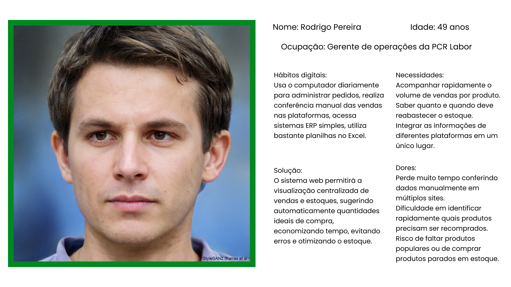

# Web Application Document - Projeto Individual - Módulo 2 - Inteli

## Pcr Labor

#### Cauã Pirilo Asquino

## Sumário

1. [Introdução](#c1)  
2. [Visão Geral da Aplicação Web](#c2)  
3. [Projeto Técnico da Aplicação Web](#c3)  
4. [Desenvolvimento da Aplicação Web](#c4)  
5. [Referências](#c5)  

<br>

## <a name="c1"></a>1. Introdução (Semana 01)

O projeto consiste no desenvolvimento de uma aplicação web para a empresa PCR Labor, com o objetivo de melhorar a integração entre plataformas de e-commerce (como Mercado Livre e Shopee). A aplicação vai consolidar informações de vendas, sugerir quantidades ideais de compra de produtos e fornecer relatórios de desempenho para facilitar o gerenciamento do estoque e a tomada de decisões comerciais.

---

## <a name="c2"></a>2. Visão Geral da Aplicação Web

### 2.1. Personas (Semana 01)

<div align="center">
  <sub></sub><br>
  <br>
  <sup>Fonte: Material produzido pelos autores, 2025</sup>
</div>

### 2.2. User Stories (Semana 01)

US01
Como gerente de operações, quero visualizar a quantidade de vendas por produto em tempo real, para que eu possa tomar decisões rápidas de reposição de estoque.

US02
Como gerente de operações, quero receber sugestões automáticas de compra baseadas no histórico de vendas, para que eu possa manter o estoque equilibrado.

US03
Como gerente de operações, quero consolidar as informações de vendas de múltiplas plataformas em um único painel, para que eu possa gerenciar os dados de forma mais eficiente.

Critério N – Negociável:
A US01 é negociável porque o gerente de operações pode escolher, por exemplo, se quer ver as vendas organizadas por categorias, por períodos específicos (últimos 7 dias, 30 dias) ou agrupadas por plataforma (Mercado Livre, Shopee). O formato e os filtros podem ser ajustados para melhor atender às necessidades do usuário sem alterar o objetivo principal da funcionalidade.

---

## <a name="c3"></a>3. Projeto da Aplicação Web

### 3.1. Modelagem do banco de dados  (Semana 3)

<div align="center">
  <sub></sub><br>
  <br>
  <sup>Fonte: Material produzido pelos autores, 2025</sup>
</div>


### Codigo SQL


```sql
-- Criação do schema
CREATE DATABASE IF NOT EXISTS bd_pcr_labor;
USE bd_pcr_labor;

-- Tabela de empresas
CREATE TABLE Empresa (
    id_empresa INT PRIMARY KEY AUTO_INCREMENT,
    nome_fantasia VARCHAR(100) NOT NULL,
    cnpj VARCHAR(18) UNIQUE NOT NULL
);

-- Tabela de usuários (ligados à empresa)
CREATE TABLE Usuario (
    id_usuario INT PRIMARY KEY AUTO_INCREMENT,
    nome VARCHAR(100) NOT NULL,
    email VARCHAR(100) UNIQUE NOT NULL,
    senha_hash VARCHAR(255) NOT NULL,
    id_empresa INT NOT NULL,
    FOREIGN KEY (id_empresa) REFERENCES Empresa(id_empresa)
);

-- Tabela de plataformas (ex: Shopee, Mercado Livre)
CREATE TABLE Plataforma (
    id_plataforma INT PRIMARY KEY AUTO_INCREMENT,
    nome VARCHAR(50) NOT NULL
);

-- Tabela de produtos (ligados à empresa)
CREATE TABLE Produto (
    id_produto INT PRIMARY KEY AUTO_INCREMENT,
    id_empresa INT NOT NULL,
    nome VARCHAR(100) NOT NULL,
    sku VARCHAR(50) UNIQUE NOT NULL,
    preco DECIMAL(10,2) NOT NULL,
    estoque_atual INT NOT NULL,
    FOREIGN KEY (id_empresa) REFERENCES Empresa(id_empresa)
);

-- Tabela de vendas
CREATE TABLE Venda (
    id_venda INT PRIMARY KEY AUTO_INCREMENT,
    id_produto INT NOT NULL,
    id_plataforma INT NOT NULL,
    quantidade INT NOT NULL,
    data DATE NOT NULL,
    FOREIGN KEY (id_produto) REFERENCES Produto(id_produto),
    FOREIGN KEY (id_plataforma) REFERENCES Plataforma(id_plataforma)
);

-- Tabela de sugestões de compra
CREATE TABLE SugestaoCompra (
    id_sugestao INT PRIMARY KEY AUTO_INCREMENT,
    id_produto INT NOT NULL,
    quantidade_sugerida INT NOT NULL,
    data_gerada DATE NOT NULL,
    FOREIGN KEY (id_produto) REFERENCES Produto(id_produto)
);
```

### 3.1.1 BD e Models (Semana 5)
*Descreva aqui os Models implementados no sistema web*

### 3.2. Arquitetura (Semana 5)

*Posicione aqui o diagrama de arquitetura da sua solução de aplicação web. Atualize sempre que necessário.*

**Instruções para criação do diagrama de arquitetura**  
- **Model**: A camada que lida com a lógica de negócios e interage com o banco de dados.
- **View**: A camada responsável pela interface de usuário.
- **Controller**: A camada que recebe as requisições, processa as ações e atualiza o modelo e a visualização.
  
*Adicione as setas e explicações sobre como os dados fluem entre o Model, Controller e View.*

### 3.3. Wireframes (Semana 03)

<div align="center">
  <sub></sub><br>
  <br>
  <sup>Fonte: Material produzido pelos autores, 2025</sup>
</div>


https://www.figma.com/design/bnIgHQ4EuyuMgQGea0ux2k/Pcr-Labor?node-id=17-193&t=MLZOHU1rxbvsHszI-1

Esse wireframe foi criado no Figma e pode ser acessado pelo link acima. Na primeira página, temos o login; na segunda página, temos um dashboard com informações de vendas, controle de estoque, gestor de tarefas e e-mails, estimativa de quantidade de compra de produtos, calendário e uma IA integrada.

### 3.4. Guia de estilos (Semana 05)

*Descreva aqui orientações gerais para o leitor sobre como utilizar os componentes do guia de estilos de sua solução.*


### 3.5. Protótipo de alta fidelidade (Semana 05)

*Posicione aqui algumas imagens demonstrativas de seu protótipo de alta fidelidade e o link para acesso ao protótipo completo (mantenha o link sempre público para visualização).*

### 3.6. WebAPI e endpoints (Semana 05)

*Utilize um link para outra página de documentação contendo a descrição completa de cada endpoint. Ou descreva aqui cada endpoint criado para seu sistema.*  

### 3.7 Interface e Navegação (Semana 07)

*Descreva e ilustre aqui o desenvolvimento do frontend do sistema web, explicando brevemente o que foi entregue em termos de código e sistema. Utilize prints de tela para ilustrar.*

---

## <a name="c4"></a>4. Desenvolvimento da Aplicação Web (Semana 8)

### 4.1 Demonstração do Sistema Web (Semana 8)

*VIDEO: Insira o link do vídeo demonstrativo nesta seção*
*Descreva e ilustre aqui o desenvolvimento do sistema web completo, explicando brevemente o que foi entregue em termos de código e sistema. Utilize prints de tela para ilustrar.*

### 4.2 Conclusões e Trabalhos Futuros (Semana 8)

*Indique pontos fortes e pontos a melhorar de maneira geral.*
*Relacione também quaisquer outras ideias que você tenha para melhorias futuras.*


## <a name="c5"></a>5. Referências

_Incluir as principais referências de seu projeto, para que seu parceiro possa consultar caso ele se interessar em aprofundar. Um exemplo de referência de livro e de site:_<br>

---
---